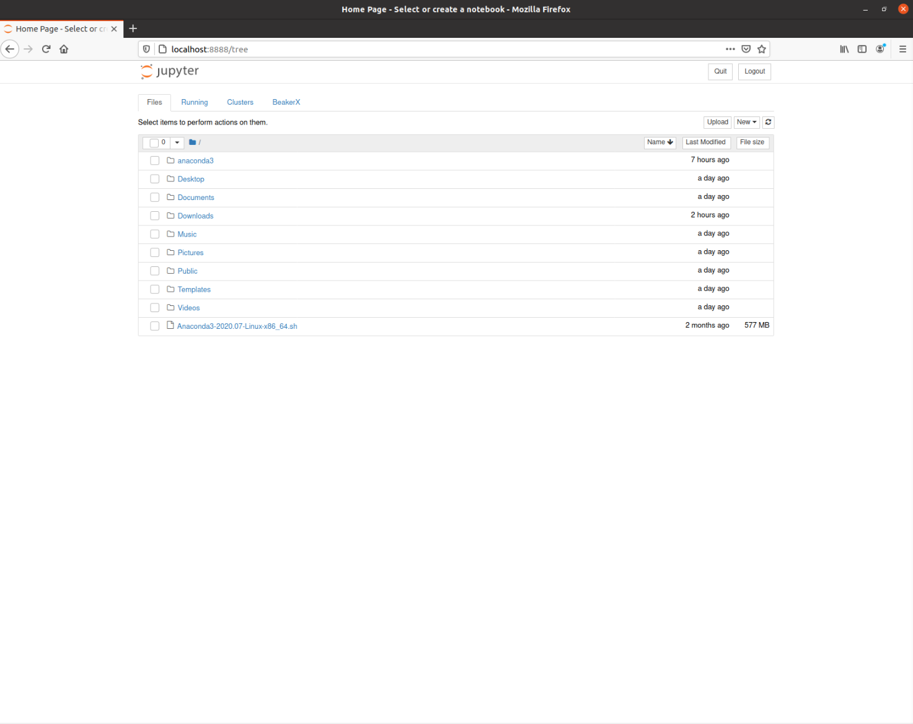
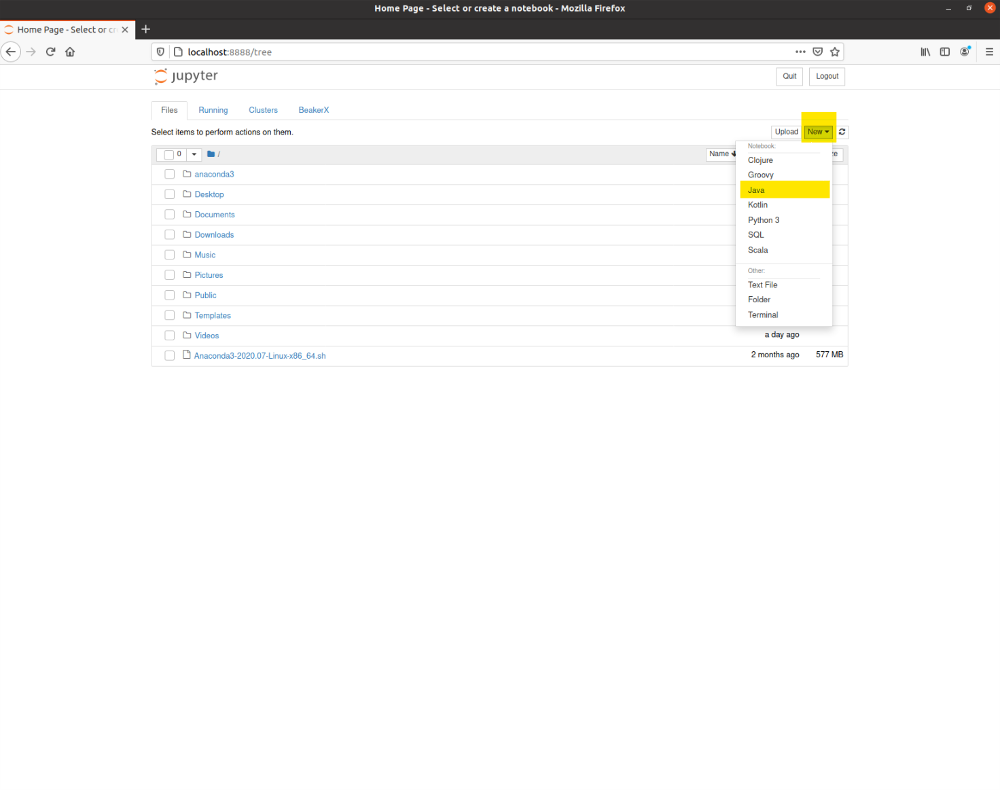
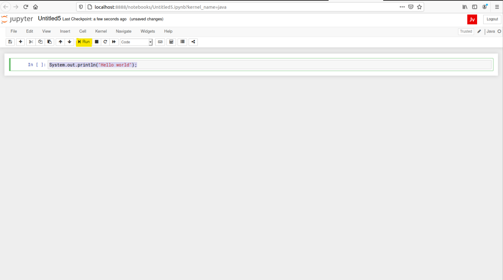
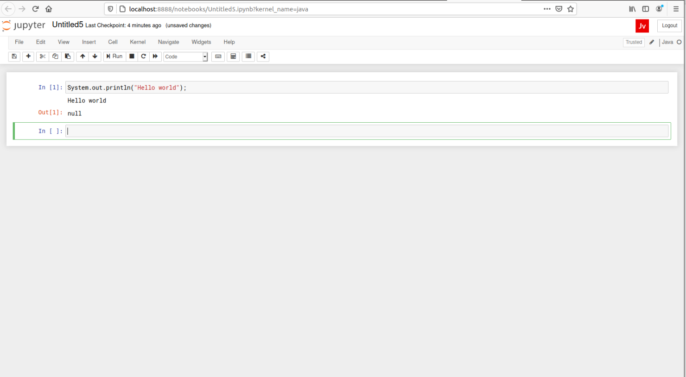

---
# Feel free to add content and custom Front Matter to this file.
# To modify the layout, see https://jekyllrb.com/docs/themes/#overriding-theme-defaults

layout: default
title : Übersicht
---

# Test der Jupyter Installation

An dieser Stelle sollten Sie Juyter-Notebooks und den BeakerX Kern installiert haben. Falls dies noch nicht der Fall ist, führen Sie bitte die Schritte in der [Installationsanleitung](installation-jupyter) durch und starten Sie die Notebook Umgebung wie dort beschrieben.

Sie sollten nun die Jupyter-Umgebung in ihrem Webbrowser sehen:
.

Erzeugen Sie nun ein neues Jupyter-Notebook indem sie Rechts auf den *New* Button drücken und Java auswählen


*Sollten Sie keinen Eintrag Java finden bedeutet dies, dass der BeakerX Kern nicht korrekt installiert wurde. Gehen Sie in diesem Fall nochmals zurück auf die [Installationsanleitung](installation-jupyter). Wie erwähnt können Sie Fragen im Forum auf Adam stellen oder Ihre(n) Tutor(in) um Hilfe bitten*. 

Nun öffnet sich ein Java Notebook. Geben Sie in die erste Zeile das Java Kommando ```System.out.println("hello world");``` ein, genau wie Sie es in folgendem Screenshot sehen. 


Wenn Sie dann auf ```Run``` drücken (im Screenshot Gelb markiert) sollten Sie folgende Ausgabe sehen:


*Herzlichen Glückwunsch. Sie haben ihr erstes Java Programm in einem Jupyter-Notebook geschrieben!*.